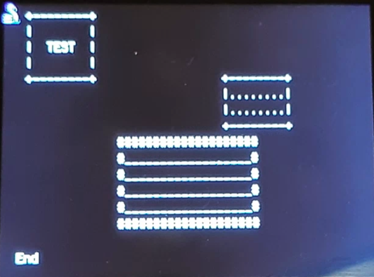

# Circuitpython-termio-lib

A tiny text-UI library for the CircuitPython REPL: position text, draw boxes,
windows and progress bars, with colors, on any ANSI/VT100 terminal — the board
display (Wio Terminal, PyPortal, ...) or a serial console (Mu, Thonny, screen, minicom...).



## Installation

Copy `code/lib/termio.py` into the `lib` folder of your `CIRCUITPY` drive,
then try `code/demo.py` (rename it `code.py`).

```python
import termio
from termio import cls, printat, rect, fillrect
```

## Coordinates

Coordinates are **0-based**: `(0, 0)` is the top left corner. `x` is the column,
`y` the line. A Wio Terminal shows about 50 columns × 20 lines.

If the top of your display is hidden (status bar), shift everything once:

```python
termio.set_offset(0, 1)   # every y gets +1
```

## Colors and styles

Most functions accept optional `fg=`, `bg=` and `style=` arguments.

| Colors | | Styles |
|---|---|---|
| `BLACK RED GREEN YELLOW` | `BRIGHT_BLACK` … | `BOLD DIM UNDERLINE` |
| `BLUE MAGENTA CYAN WHITE` | … `BRIGHT_WHITE` | `BLINK REVERSE RESET` |

```python
printat(2, 1, "Warning!", fg=termio.RED, style=termio.BOLD)
termio.color(termio.BLACK, termio.YELLOW)   # for everything printed afterwards
print("highlighted")
termio.reset()
```

## Functions

### Screen and cursor

| Function | Description |
|---|---|
| `cls()` | clear the screen, cursor to (0, 0) |
| `home()` | cursor to (0, 0) without clearing |
| `goto(x, y)` | move the cursor |
| `clear_line(y=None)` | clear line `y` (or the current line) |
| `clear_eol()` | clear to the end of the line |
| `cursor(visible)` | show / hide the cursor |
| `save_cursor()` / `restore_cursor()` | remember / go back to the cursor position |
| `set_offset(x, y)` | shift all drawings |
| `clear_rect(x, y, width, height)` | blank an area |
| `scroll_region(top, bottom)` | only scroll lines `top..bottom` (no args: whole screen) |

### Text

| Function | Description |
|---|---|
| `printat(x, y, text, fg, bg, style)` | print `text` at `x, y` |
| `center(y, text, width, ...)` | center `text` on line `y` of a `width` wide screen |
| `wrap(text, width)` | split `text` into a list of lines, breaking on spaces |
| `textat(x, y, text, width, height=None)` | print word-wrapped text in a column |

### Drawing

| Function | Description |
|---|---|
| `hline(x, y, length, char="-")` | horizontal line |
| `vline(x, y, length, char="\|")` | vertical line |
| `rect(x, y, width, height, char="")` | rectangle outline |
| `fillrect(x, y, width, height, char="", fillchar=" ")` | filled rectangle |
| `window(x, y, width, height, title="")` | box with a title in its top border |
| `progress(x, y, width, value, maximum=100)` | `[#####.....]  50%` |
| `textbox(x, y, width, height, text, title="")` | window filled with word-wrapped text |
| `table(x, y, rows, widths=None, header=True)` | ASCII table, returns its height |
| `spinner(x, y, step)` | one frame of a `\| / - \\` spinner |

### Keyboard (USB serial console)

| Function | Description |
|---|---|
| `getkey(blocking=True)` | one key: a char or `UP DOWN LEFT RIGHT ENTER ESCAPE BACKSPACE`; `None` if non-blocking and nothing typed |
| `menu(x, y, items, selected=0)` | arrow-key menu, returns the chosen index or `None` (Escape / `q`) |
| `input_at(x, y, prompt="")` | print a prompt at `x, y` and read a line |

```python
choice = termio.menu(4, 3, ["Start", "Settings", "Quit"])
termio.table(0, 10, [["sensor", "value"], ["temp", 21.5], ["hum", "40%"]])
```

`char` for `rect` / `fillrect` / `window` can be:

- `""` — ASCII box made of `+ - |`
- any single char, e.g. `"#"`
- a box style: `termio.BOX_ASCII`, `BOX_SINGLE` `┌─┐`, `BOX_DOUBLE` `╔═╗`, `BOX_ROUND` `╭─╮`
  (the unicode styles need a font with box-drawing characters; the built-in
  display font of some boards does not have them, ASCII always works).

### Example

```python
import termio
from termio import cls, printat, rect, fillrect, window, progress

cls()
printat(5, 4, "Hello World!")
rect(2, 2, 10, 5)                      # + - | box
fillrect(15, 10, 20, 6, "#", "_")      # border made of #, filled with _
window(2, 12, 30, 4, "Status", fg=termio.GREEN)
progress(4, 14, 26, 75, fg=termio.GREEN)
```

## Compatibility notes

- Serial terminals support every feature.
- The on-board display terminal of CircuitPython understands cursor moves and
  clearing; color and cursor visibility support depends on the CircuitPython
  version — unsupported sequences are simply ignored.

## Tests

The library runs on desktop Python too:

```sh
python -m unittest discover tests
```

## Upgrading from 1.x

Coordinates used to be off by one (`x=0` and `x=1` were the same column).
They are now exact, so old drawings appear one cell up/left. See [CHANGELOG.md](CHANGELOG.md).

## License

MIT — BeBoX
