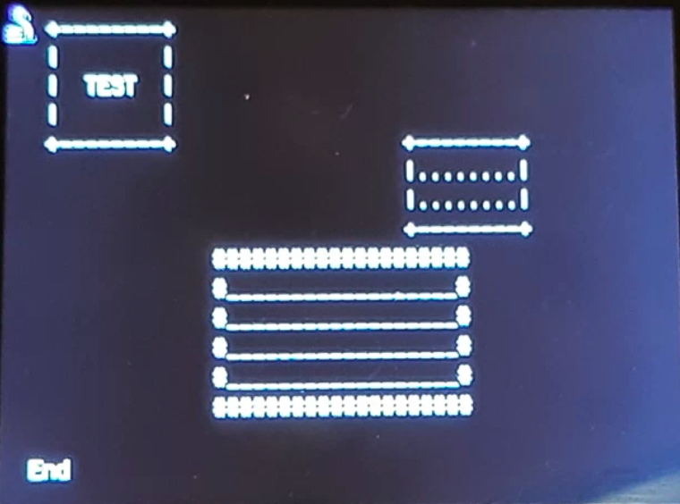

# Circuitpython-termio-lib
a simple REPL display lib for circuitpython

# Fonctions

## cls
clear terminal screen and set cursor on top left : coords 0,0

usage :

from termio import cls as cls 
cls()

## printat
set cursor position and print 

syntax : printat(x,y,value)

coords start from top left and depend on you display size. 

example on wio terminal 50 chars wide on 20 lines
then x is between 0 and 49 
and lines are from 0 to 19 (on wio terminal it's strange display line start on 2 , then think to add a 2 offset on your code)

usage :

from termio import printat as printat 
printat(5,10,"Hello World!") 
